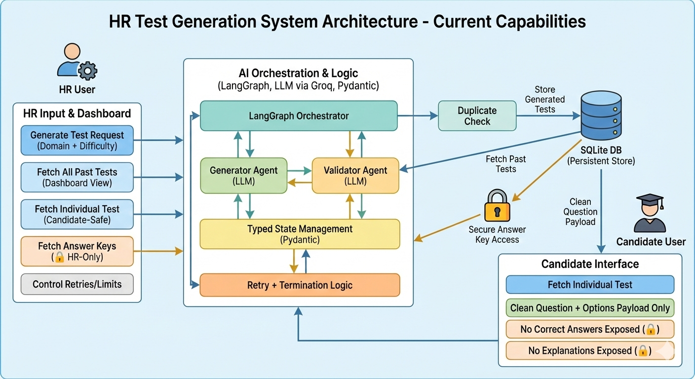

# 🤖 AI Hiring Test Generator

A powerful, AI-driven API designed to automate the creation of technical screening tests for hiring. Built with **FastAPI**, **LangGraph**, and **LangChain**, this application orchestrates an intelligent agent to generate, validate, and store high-quality technical questions tailored to specific domains and difficulty levels.

## ✨ Features

- **autonomous Test Generation**: Uses an AI agent loop (Generate → Validate → Store) to create cohesive test sets.
- **Customizable Criteria**: tailored generation based on:
  - **Domains** (e.g., Python, SQL, System Design)
  - **Difficulty Levels** (Easy, Medium, Hard) across a distribution mix.
- **Quality Assurance**: Automated validation step ensures questions meet quality standards before reaching the user.
- **Secure Handling**: 
  - Candidates see only the questions and options.
  - HR/Admins access the Answer Key via a secured endpoint.
- **Persistence**: Relational database storage (SQLite/SQLAlchemy) for test retrieval and auditing.

## 🛠️ Tech Stack

- **Framework**: [FastAPI](https://fastapi.tiangolo.com/)
- **Orchestration**: [LangGraph](https://langchain-ai.github.io/langgraph/) & [LangChain](https://www.langchain.com/)
- **LLM Provider**: (Configured via environment, e.g., Groq)
- **Database**: SQLite with [SQLAlchemy](https://www.sqlalchemy.org/) ORM
- **Runtime**: Python 3.10+

## 🚀 Getting Started

### Prerequisites

- Python 3.10 or higher
- An API key for your LLM provider (e.g., Groq)

### Installation

1.  **Clone the repository:**
    ```bash
    git clone <your-repo-url>
    cd mvp
    ```

2.  **Create and activate a virtual environment:**
    ```bash
    python -m venv .venv
    source .venv/bin/activate  # On Windows: .venv\Scripts\activate
    ```

3.  **Install dependencies:**
    ```bash
    pip install -r requirements.txt
    ```

4.  **Set up environment variables:**
    Create a `.env` file in the root directory:
    ```bash
    touch .env
    ```
    Add the following configurations:
    ```env
    GROQ_API_KEY=your_groq_api_key_here
    HR_SECRET_KEY=your_secure_hr_secret
    ```

### ▶️ Running the Application

Start the development server:

```bash
uvicorn main:app --reload
```

The API will be available at `http://localhost:8000`.

## 📚 API Documentation

Once the server is running, you can access the interactive API docs at `http://localhost:8000/docs`.

### Key Endpoints

#### 1. Generate a Test
**POST** `/generate-test`
Triggers the AI agent to generate a unique test.

**Body:**
```json
{
  "level": "Senior",
  "domains": ["Python", "FastAPI"],
  "difficulty_mix": {
    "easy": 2,
    "medium": 5,
    "hard": 3
  },
  "max_attempts": 3
}
```

#### 2. Get a Test (Candidate View)
**GET** `/tests/{test_id}`
Returns the test details and questions *without* the correct answers.

#### 3. Get Answer Key (HR Only)
**GET** `/tests/{test_id}/answer-key`
Returns the questions with correct options and explanations.
**Headers:**
`X-HR-KEY`: `<your_HR_SECRET_KEY>`

## 📂 Project Structure

```
├── api/             # API Routes and Schemas
├── core/            # Core state definitions
├── db/              # Database models and connection logic
├── orchestrator/    # LangGraph agent worklfow (Nodes & Edges)
├── main.py          # Application entry point
├── requirements.txt # Project specific dependencies
```

## 🏗️ System Design



## 🤝 Contributing

Contributions are welcome! Please feel free to submit a Pull Request.

---
*Built for the future of hiring.*
